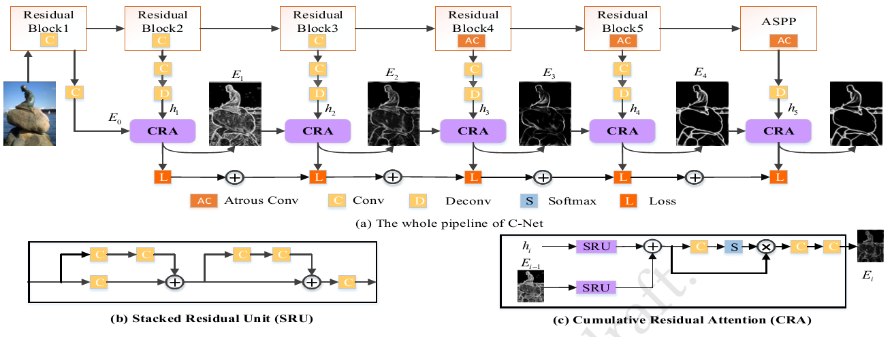

## Cumulative Nets for Edge Detection

--------------------

------------------
### Introduction
Lots of recent progress have been made by using Convolutional Neural Networks (CNN) for edge detection. Due to the nature of hierarchical representations learned in CNN, it is intuitive to design side networks utilizing the richer convolutional features to improve the edge detection. However, different side networks are isolated, and the final results are usually weighted sum of the side outputs with uneven qualities. To tackle these issues, we propose a Cumulative Network (C-Net), which learns the side network cumulatively based on current visual features and low-level side outputs, to gradually remove detailed or sharp boundaries to enable high-resolution and accurate edge detection. Therefore, the lower-level edge information is cumulatively inherited while the superfluous details are progressively abandoned. In fact, recursively Learning where to remove superfluous details from the current edge map with the supervision of a higher-level visual feature is challenging. Furthermore, we employ atrous convolution (AC) and atrous convolution pyramid pooling (ASPP) to robustly detect object boundaries at multiple scales and aspect ratios. Also, cumulatively refining edges using high-level visual information and lower-lever edge maps is achieved by our designed cumulative residual attention (CRA) block. Experimental results show that our C-Net sets new records for edge detection on both two benchmark datasets:BSDS500 and NYUDv2.

----------------------
### Dataset
The datasets that we use are same  as HED and RCF, if we want to download the datasets(BSDS500 and NYUDv2), please run the codes as below.

    wget http://mftp.mmcheng.net/liuyun/rcf/data/HED-BSDS.tar.gz
    wget http://mftp.mmcheng.net/liuyun/rcf/data/NYUD.tar.gz
 Thanks  HED and RCF for the augmented datasets.
 You can change the `data_dir` in `train.py` to load a dataset.

-----------------------

### Requirement
The code has been tested successfully on Ubuntu 14.04 with CUDA 8.0.	And the code is based on Tensorflow1.4, besides,  the numpy and scipy are also necessary.

-----------------------

### Train

	    python train.py
`os.environ["CUDA_VISIBLE_DEVICES"]`: choose the gpu that you want to use. And the model will saved in `./snapshots` .

You could change `MODEL_NAME` to change the name of experiments and saved models.

The Resnet101 model pre-trained on ImageNet is caffe-tensorflow model.

The pre-trained model on BSDS is [here](https://drive.google.com/drive/folders/1aQfBVWVHJ3KzBpvovmw5KlLPCa5vgPld?usp=sharing).

The pre-trained model on NYUD is [here](https://drive.google.com/drive/folders/1DAmTuJlFfWS7B8OD-69vkYtemDQ9Y2B4?usp=sharing).

--------------------
	  
### Test

	    python evaluate.py	   
The rusults will be saved in `./results/MODEL_NAME/`
Before evaluating the  edges,  the standard non-maximum suppression (NMS) is necessary which makes edge thin.
